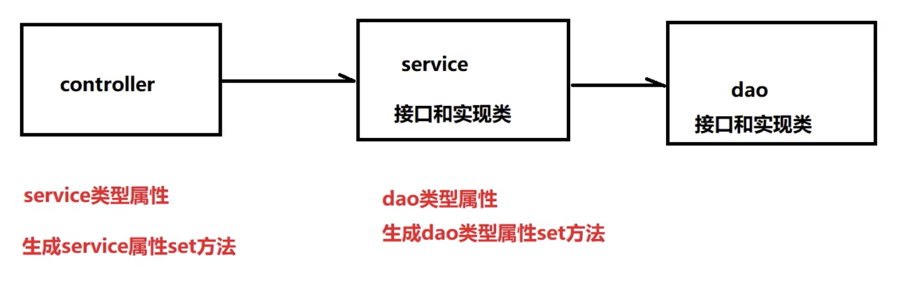

# SPRING6

2022年11月，Spring6正式版本发布，标志着一个新的时代的到来，本套课程正是基于这个背景进行录制，课程采用Spring6最新发布的正式版本


Spring框架是一款极其优秀的轻量级开源框架，为了解决企业应用开发的复杂性而出现。Spring框架的用途不仅仅限于服务器端的开发，从简单性、可测试性和松耦合性角度而言，绝大部分Java应用都可以从Spring中受益。Spring框架凭借其强大的功能和优良的性能，在企业开发中被广泛应用

掌握Java基础知识（特别是反射）
掌握Java注解
掌握XⅪML
掌握Maven


Spring6框架
第一章概述

第二章入门

第三章容器：IOC

==第四章原理：手写IOC==

==第五章  面向切面：AOP==

第六章单元测试：JUNIT

第七章 :事务

第八章  资源操作：Resources

第九章 国际化：i18n

第十章数据校验：Validation

第十一章 ==提前编译：AOT==


# 第一章概述

### 1.1、Spring什么?

Spring是一款主流的Java EE轻量级开源涯架，Spring由Spring之父Rod Johnson提出并创立，其目的是用于简化Java企业级应用的开发难度和开发周期。Spring的用途不仅限于服务器端的开发。从简单性、可测试性和松偶合的角度而言，任何java应用都可以从Spring中受益。Spring框架除了自己提供功能外，还提供整合其他技术和框架的能力，

Spring自诞生以来备受青睐，一直被广大开发人员作为Java企业级应用程序开发的首选。时至今日，Spring俨然成为了Java EE代名词，成为了构建Java EE应用的事实标准
自2004年4月，Spring1.0板本正式发布以来，Spring已经步入到了第6个大版本，也就是Spring6。本课程采用Spring当前最新发布的正式版本6.0.2.


### 1.2、Spring的狭义和广义

在不同的语境中，Spring所代表的含义是不同的。下面我们就分别从“广义“和"狭义"两个角度，对Spring进行介绍。

* 广义的Spring:Spring技术栈
  广义上的Spring泛指以Spring Framework为核心的Spring技术栈。
  经过十多年的发展，Spring已经不是一个单纯的应用框架，而是逐渐发展成为一个由多个不同子项目（模块）组成的成熟技术，如Spring Framework、Spring MVC、SpringBoot、.Spring Cloud、Spring Data , Spring Security等，其中Spring Framework是其他子项目的基础.
  这些子项目通盖了从企业级应用开发到云计算等各方面的内容，能够帮助开发人员解决软件发展过程中不断产生的各种实际问题，给开发人员带来了更好的开发体验。

* 狭义的Spring:Spring Framework
  狭义的Spring特指Spring Framework, 通常我们将它称为Spring框架，
  Spring框架是一个分层的、面向切面的ava应用程序的一站式轻量级解决方案，它是Spring技术栈的核心和基础，是为了解决企业级应用开发的复杂性而创建的.

  Spring有两个最核心模块：IoC和AOP。

  * IoC:==Inverse of Control的简写，译为"控制反转"==，指把创建对象过程交给Spring进行管理。
  * AOP : Aspect Oriented Programming的简写，译为"面向切面编程"。AOP用来封装多个类的公共行为，将那些与业务无关，却为业务模块所共同调用的逻辑封装起来，减少系统的重复代码，降低模块间的耦合度。另外，AOP还解决一些系统层面上的问题，比如日志、事务、权限等，


### 1.3、Spring Framework特点

* 非侵入式：使用Spring Framework开发应用程序时，Spring对应用程序本身的结构影响非常小。==对可以做到零污染==；对功能性组件色只需要使用几个简单的注解进行标记，完全不会破坏原有结构，反而能将组件结构进一步简化。这就使得基于Spring Framework开发应用程序时结构清晰、简洁优雅.

  

* 控制反转：IOC一一inversion of Control,割转资源获取方向。把自己创建资源、向环境索取资源变成环境将资源准备好，我们享受资源注入。


* 面向切面编程：AOP一一Aspect Oriented Programming,在不修改源代码的基础上增强代码功能.


* 容器：Spring IOC是一个容器，因为它包含并且管理组件对象的生命周期。组件享受到了容器化的管理，替程序员屏蔽了组件创建过程中的大量细节，极大的降低了使用门槛，大幅度提高了开发效率。


* 组件化：Spring实现了使用简单的组件配置组合成一个复杂的应用。在Spring中可以使用XML和Java注解组合这些对象，这使得我们可以基于一个个功能明确、边界清晰的组件有条不素的搭建超大型复杂应用系统


* 一站式：在IOC和AOP的基础上可以整合各种企业应用的开源框架和优秀的第三方类库，而且Spring旗下的项目已经覆盖了广泛领域，很多方面的功能性需求可以在Spring Framework的基础上全部使用Spring来实现


### 1.4、Spring模块组成


①Spring Core(核心容器)
spring core提供了IOC,Dl,Bean配置装载创建的核心实现。核心概念：Beans、BeanFactory、BeanDefinitions、ApplicationContext.

* spring-core:IOC和Dl的基本实现

* spring-beans:BeanFactory和Bean的装配管理(BeanFactory)

* spring-context:Spring context.上下文，即IOC容器(AppliactionContext)

* spring-expression:spring表达式语言

  

②Spring AOP

* spring-aop:面向切面偏编程的应用模块，整合ASM,CGLib,JDK Proxy
* spring-aspects:集成AspecJ,AOP应用框架
* spring-instrument:动态Class Loading模块


3.Spring Data Access

* spring-jdbc:spring对JDBC的封装，用于简化jdbc操作

* spring-orm:java对象与数据库数据的映射框架

* spring-oxm:对像与xml文件的映射框架

* spring-jms:Spring对 Java Message Service(java消息服务)的封装，用于服务之间相互通信

* spring-tx :spring jdbc事务管理

  

④Spring Web

* spring-web:最基础的web支持，建立于spring-context之上，通过servlet或listener来切始化lOC容器
* spring-webmvc:实现web mvc
* spring-websocket:与前端的全双工通信协议
* spring-webflux:Spring5.O提供的，用于取代传统ava servlet,非阻塞式Reactive Web框架，异步，非阻塞，事件驱动的服务


⑤Spring Message

* Spring-messaging:  spring4.0提供的，为Spring集成一些基础的报文传送服务


⑥Spring test

* spring-test:集成测试支持，主要是对junit的封装


### 1.5、Spring6特点

### 1.5.1、版本要求

(1) Spring6要求JDK最低版本是JDK17

### 1.5.2、本课程软件版本

(1)  IDEA开发工具：2022.1.2
(2)  JDK:Java17(Spring6要求DK最低版本是ava17)
(3)  Spring:6.0.2


# 2.1 入门开发案例


```java
package com.test.spring6;

import org.junit.Test;
import org.springframework.context.ApplicationContext;
import org.springframework.context.support.ClassPathXmlApplicationContext;

public class TestUser {

    @Test
    public void testUserObject() {
        // 加载spring的配置文件,进行对象的创建
        ApplicationContext context = new ClassPathXmlApplicationContext("bean.xml");

        // 获取创建的对象
        User user = (User) context.getBean("user");
        System.out.println(user);

        // 使用对象调用方法进行测试
        user.add();
    }

}


<?xml version="1.0" encoding="UTF-8"?>
<beans xmlns="http://www.springframework.org/schema/beans"
       xmlns:xsi="http://www.w3.org/2001/XMLSchema-instance"
       xsi:schemaLocation="http://www.springframework.org/schema/beans http://www.springframework.org/schema/beans/spring-beans.xsd">

    <!--完成user对象创建
     bean标签
        id属性 :唯一标识
        class属性 : 要创建对象所在类的全路径(包名称 + 类名称)
    -->
    <bean id="user" class="com.test.spring6.User"></bean>
</beans>啊
      
通过spring创建对象
```

通过Spring创建对象和new一个对象之间的区别

```java
1,之前创建对象,无参数构造执行?
  
2,不用new的方式,还可以如何创建对象
  反射
3,创建的对象放在哪里?
通过反射创建出来的对象都储存在map里面Map<String, BeanDefinition> beanDefinitionMap中,以key,Value的方式存储
key:唯一标识
Value:类的定义(描述信息)
  
  
4,如何使用反射创建的对象
  * 加载bean.xml配置文件
  * 对xml文件进行解析操作
  * 获取xml文件bean标签属性
  id属性值和class属性值
  *使用反射根据类全路径创建对象
  //反射创建对象
    @Test
    public void testUserObject1() throws Exception {
        //获取类Class对象
        Class clazz = Class.forName("com.test.spring6.User");
        //调用方法创建对象
        //Object o = clazz.newInstance();
        User user = (User) clazz.getDeclaredConstructor().newInstance();
        System.out.println(user);
    }
```


3. 把创建好的对象存储到一个什么样的数据结构当中了呢？

bean对象最终存储在spring容器中，在spring源码底层就是一个map集合，存储bean的map在DefaultListableBeanFactory类中：

```java
private final Map<string,BeanDefinition>beanDefinitionMap = new ConcurrentHashMap<>(256);
```

Spring容器加载到Bean类时，会把这个类的描述信息，以包名加类名的方式存到beanDefinitionMap中，
Map<String,BeanDefinition>:,其中String是Key,默认是类名首字母小写，BeanDefinition,存的是类的定义（描述信息)，我们通常叫BeanDefinition接口为：bean的定义对象，


### 2.5、启用Log4j2日志框架

2.5.1、L0g4j2日志概述

在项目开发中，日志十分的重要，不管是记录运行情况还是定位线上问题，都离不开对日志的分析。日志记录了系统行为的时间、地点、状态等相关信息，能够帮助我们了解并监控系统状态，在发生错误或者接近某种危险状态时能够及时提醒我们处理，同时在系统产生问题时，能够帮助我们快速的定位、诊断并解决问题。


==Apache Log4j2==是一个开源的日志记录组件，使用非常的广泛。在工程中以易用方便代替了System.out等打印语句,  它是JAVA下最流行的日志输入工具。

Log4j2主要由几个重要的组件构成：

(1)**日志信息的优先级，**

日志信息的优先级从高到低有TRACE<DEBUG<INFO<WARN<ERROR<FATAL

TRACE:追踪，是最低的日志级别，相当于追踪程序的执行

DEBUG:调试，一般在开发中，都将其设置为最低的日志级别

INFO:信息，输出重要的信息，使用较多

ERROR:错误，输出错误信息

FATAL:严重错误

这些级别分别用来指定这条日志信息的重要程度；级别高的会自动屏蔽级别低的日志，也就是说,设置了WARN日志,INFO和DEBUG级别的日志不会显示


(2)日志信息的输出目的地，日志信息的输出目的地指定了日志将打印到控制台  还是文件中;

(3)日志信息的输出格式，而输出格式则控制了日志信息的显示内容


2.5.2 引入Log4j2依赖

```maven
dependency>
            <groupId>org.apache.logging.log4j</groupId>
            <artifactId>log4j-slf4j-impl</artifactId>
            <version>2.10.0</version>
        </dependency>

        <dependency>
            <groupId>org.apache.logging.log4j</groupId>
            <artifactId>log4j-core</artifactId>
            <version>2.10.0</version>
        </dependency>
```


2.5.3加入日志配置文件

```java
<?xml version="1.0" encoding="utf-8" ?>
<configuration>
    <loggers>
        <!--
        leveL指定日志级别，从低到高的优先级：
        TRACE < DEBUG < INFO < WARN < ERROR < FATAL
        trace:追踪，是最低的日志级别，相当于追踪程序的执行
        debug:调试，一般在开发中，都将其设置为最低的日志级别
        info:信息，输出重要的信息，使用较多
        warn:警告，输出警告的信息
        error:输入错误信息
        fatal:严重错误
        -->
    <root level="DEBUG">
        <appender-ref ref="spring6log"/>
        <appender-ref ref="RollingFile"/>
        <appender-ref ref="log"/>
    </root>
    </loggers>

    <appenders>
        <!--输出日志信息到控制台-->
        <console name="spring6log" target="SYSTEM_OUT">
            <!--控制日志输出的格式-->
            <PatternLayout pattern="%d{yyyy-MM-dd HH:mm:ss SSS} [%t] %-3level %logger{1024} -%msg%n"/>
        </console>

        <File name="log" fileName="/Volumes/prom/Spring6/spring6_log/test.log"  append="false">
            <PatternLayout pattern="%d{HH:mm:ss SSS} %-5level %class{36} %L %M -%msg%xEx%n"/>
        </File>

        <RollingFile name="RollingFile" fileName="/Volumes/prom/Spring6/spring6_log/app.log"
                     filePattern="log/$${date:yyyy-MM}/app-%d{MM-dd-yyyy}-%i.log.gz">
            <PatternLayout pattern="%d{yyyy-MM-dd 'at' HH:mm:ss z} %-5level %class{36} %L %M -%msg%xEx%n"/>
            <SizeBasedTriggeringPolicy size="50 MB" />
            <DefaultRolloverStrategy max="20"/>
        </RollingFile>
    </appenders>

</configuration>
```


# 3、容器：IoC

loC是Inversion of Control的简写，译为控制反转"，它不是一门技术，而是一种设计思想，是一个重要的面向对象编程法则，能够指导我们如何设计出松耦合、更优良的程序

Spring通过IoC容器来管理所有==java对象的实例化和初始化==，控制对象与对象之间的依赖关系。我们将由IoC容器管理的java对象称为Spring Bean,它与使用关键字new创建的java对象没有任何区别。
loC容器是Spring框架中最重要的核心组件之一，它贯穿了Spring从诞生到成长的整个过程.


## 3.1、IoC容器

#### 3.1.1、控制反转(IoC)

* 控制反转是一种思想。
* 控制反转是为了降低程序耦合度，提高程序扩展力。
* 控制反转，反转的是什么？
  * 将对象的创建权利交出去，交给第三方容器负责。
  * 将对象和对象之间关系的维护权交出去，交给第三方容器负责。
* 控制反转这种思想如何实现呢？
  * DI(Dependency Injection):依赖注入

#### 3.1.2、依赖注入

Dl(Dependency Injection):依赖注入，依赖注入实现了控制反转的思想
**依赖注入：**

* **指Spring创建对象的过程中，将对象依赖属性通过配置进行注入**

  

依赖注入常见的实现方式包括两种：

* 第一种：set注入
* 第二种：构造注入


所以结论是：IOC就是一种控制反转的思想，而DI是对IoC的一种具体实现。
**Bean管理说的是：Bean对像的创建，以及Bean对象中属性的赋值（或者叫做Bean对象之间关系的维护）。**

(对象的创建过程和属性的注入过程)

#### 3.1.3、IoC容器在Spring的实现

Spring的IoC容器就是loC思想的一个落地的产品实现。IoC容器中管理的组件也叫做bean。在创建bean之前，首先需要创建IoC容器。

在创建bean之前，首先需要创建IoC容器。Spring提供了IoC容器的两种实现方式：
①BeanFactory
这是IoC容器的基本实现，是Spring内部使用的接口。面向Spring本身，不提供给开发人员使用。
②ApplicationContext
BeanFactory的子接口，提供了更多高级特性。面向Spring的使用者，几乎所有场合都使用ApplicationContext
而不是底层的BeanFactory。
③ApplicationContext的主要实现类

Spring的IoC容器就是IoC思想的一个落地的产品实现。loC容器中理的组件也叫做bean。在创建bean之
前，首先需要创建IoC容器。Spring提供了IoC容器的两种实现方式：
①BeanFactory
这是IoC容器的基本实现，是Spring内部使用的接口。面向Spring本身，不提供给开发人员使用。
②ApplicationContext
BeanFactory的子接口，提供了更多高级特性。面向Spring的使用者，几乎所有场合都使用ApplicationContext
而不是底层的BeanFactory。
③ApplicationContext的主要实现类


## 3.2、基于XML管理bean

#### 3.2.1、搭建子模块spring6-ioc-xml

#### 3.2.2、实验一：获取bean

```java
package com.test.spring6.iocxml;

import org.springframework.context.ApplicationContext;
import org.springframework.context.support.ClassPathXmlApplicationContext;


public class TestUser {

    public static void main(String[] args) {

        ApplicationContext context = new
                ClassPathXmlApplicationContext("bean.xml");

        //1. 根据id获取获取bean
        User user1 = (User) context.getBean("user1");
        User user4 = (User) context.getBean("user");
        System.out.println("1. 根据id获取获取bean: " + user1);
        System.out.println("1. 根据id获取获取bean: " + user4);

        //2. 根据类型获取bean
        //如果获取的对象的类路径是一样的,创建类的时候就hi
        //User user2 = context.getBean(User.class);
        //System.out.println("2. 根据类型获取bean: " + user2);

        //3. 根据 id 和 类型获取bean
        //User user3 = context.getBean("user", User.class);
        //System.out.println("3. 根据 id 和 类型获取bean" + user3);
    }

}

resources中的bean.
<?xml version="1.0" encoding="UTF-8"?>
<beans xmlns="http://www.springframework.org/schema/beans"
       xmlns:xsi="http://www.w3.org/2001/XMLSchema-instance"
       xsi:schemaLocation="http://www.springframework.org/schema/beans http://www.springframework.org/schema/beans/spring-beans.xsd">
    
    <!--user对象的创建-->
    <bean name="user" class="com.test.spring6.iocxml.User"></bean>
    <bean name="user1" class="com.test.spring6.iocxml.User"></bean>
</beans>
```

根据类型获取bean时，要求IOC容器中指定型的bean有且只能有一个

当IOC容器中一共配置了两个：

```java
<bean id="helloworldone"class="com.atguigu.spring6.bean.Helloworld"></bean>
<bean id="helloworldTwo"class="com.atguigu.spring6.bean.Helloworld"></bean>
```

会报错

```java
Exception in thread "main"org.springframework.beans.factory.NoUniqueBeanDefinitionException: No qualifying bean of type 'com.test.spring6.iocxml.User' available: expected single matching bean but found 2: user,user1
```


⑤扩展知识

如果组件类实现了接口，根据接口类型可以获取bean吗？

可以，前提是bean唯一

如果一个接口有多个实现类，这些实现类都配置了bean,根据接口类型可以获取bean吗？

不行，因为bean不唯一

结论根据类型来获取bean时，在满足bean唯一性的前提下，其实只是看：『对象instanceof指定的类型』的返回结果，只要返回的是true就可以认定为和类型匹配，能够获取到.

java中，instanceofi运算符用于判断前面的对象是否是后面的类，或其子类、实现类的实例。如果是返回true,否
则返回false。也就是说：用instanceof:关键字做判断时，instanceof操作符的左右操作必须有继承或实现关系

```java
Exception in thread "main" org.springframework.beans.factory.NoUniqueBeanDefinitionException: No qualifying bean of type 'com.test.spring6.iocxml.bean.UserDao' available: expected single matching bean but found 2: userDaoImpl,personDaoImpl
```

通过相同的接口实例化不同的对象不能构建bean


#### 3.2.3、实验二：依赖注入之setter注入

依赖注入的意思就是,在创建对象的过程中,向属性设置值

第一种方式:基于set方式完成

第二种方式:基于构造器的方式完成

```java
package com.test.spring6.iocxml.di;

public class Book {

    private String bname;
    private String author;

    public Book() {
    }

    public Book(String bname, String author) {
        this.bname = bname;
        this.author = author;
    }

    public String getBname() {
        return bname;
    }

    public void setBname(String bname) {
        this.bname = bname;
    }

    public String getAuthor() {
        return author;
    }

    public void setAuthor(String author) {
        this.author = author;
    }

    // 原生方式注入属性
    public static void main(String[] args) {
        // set方法注入对象的属性
        Book book = new Book();
        book.setBname("java");
        book.setAuthor("Ao");

        // 通过构造器注入
        Book book1 = new Book("C++","Ao");

    }
}
```


使用spring通过这两种方式

* 依赖注入方式一,使用set方法注入

第一步,创建类,定义属性,生成属性set方法

```java
package com.test.spring6.iocxml.di;

public class Book {

    private String bname;
    private String author;

    public  Book() {
    }

    public Book(String bname, String author) {
        this.bname = bname;
        this.author = author;
    }

    public String getBname() {
        return bname;
    }

    public void setBname(String bname) {
        this.bname = bname;
    }

    public String getAuthor() {
        return author;
    }

    public void setAuthor(String author) {
        this.author = author;
    }

    @Override
    public String toString() {
        return "Book{" +
                "bname='" + bname + '\'' +
                ", author='" + author + '\'' +
                '}';
    }

    // 原生方式注入属性
    public static void main(String[] args) {
        // set方法注入对象的属性
        Book book = new Book();
        book.setBname("java");
        book.setAuthor("Ao");

        // 通过构造器注入
        Book book1 = new Book("C++","Ao");
    }
}

package com.test.spring6.iocxml.di;

import org.junit.Test;
import org.springframework.context.ApplicationContext;
import org.springframework.context.support.ClassPathXmlApplicationContext;

public class TestBook {
    @Test
    public void testSetter() {
        //spring底层就是调用对象的set方法
        ApplicationContext context =
                new ClassPathXmlApplicationContext("bean-di.xml");
        Book book = context.getBean("book", Book.class);
        System.out.println(book);
    }
}
```

第二步,在spring.xml配置配置文件配置

```java
<?xml version="1.0" encoding="UTF-8"?>
<beans xmlns="http://www.springframework.org/schema/beans"
       xmlns:xsi="http://www.w3.org/2001/XMLSchema-instance"
       xsi:schemaLocation="http://www.springframework.org/schema/beans http://www.springframework.org/schema/beans/spring-beans.xsd">
    <!-- set方法完成注入-->
    <bean name="book" class="com.test.spring6.iocxml.di.Book">
        <property name="bname" value="前端开发"></property>
        <property name="author" value="Ao"></property>
    </bean>
</beans>
```


#### 3.2.4、实验三：依赖注入之构造器注入

* 依赖注入方式二,使用构造器方法注入

第一步, 创建类,定义属性,生成有参数构造的方法

```java
package com.test.spring6.iocxml.di;

public class Book {

    private String bname;
    private String author;

    public  Book() {
    }
		
  	//有参数的构造方法
    public Book(String bname, String author) {
        this.bname = bname;
        this.author = author;
    }

    public String getBname() {
        return bname;
    }

    public void setBname(String bname) {
        this.bname = bname;
    }

    public String getAuthor() {
        return author;
    }

    public void setAuthor(String author) {
        this.author = author;
    }

    @Override
    public String toString() {
        return "Book{" +
                "bname='" + bname + '\'' +
                ", author='" + author + '\'' +
                '}';
    }

    // 原生方式注入属性
    public static void main(String[] args) {
        // set方法注入对象的属性
        Book book = new Book();
        book.setBname("java");
        book.setAuthor("Ao");

        // 通过构造器注入
        Book book1 = new Book("C++","Ao");

    }
}

```

第二步,进行spring,xml文件的配置

```java
<?xml version="1.0" encoding="UTF-8"?>
<beans xmlns="http://www.springframework.org/schema/beans"
       xmlns:xsi="http://www.w3.org/2001/XMLSchema-instance"
       xsi:schemaLocation="http://www.springframework.org/schema/beans http://www.springframework.org/schema/beans/spring-beans.xsd">

<!-- 2. 构造器方法完成注入-->
    <bean name="bookCon" class="com.test.spring6.iocxml.di.Book">
        <!--根据属性的名称进行注入-->
        <constructor-arg name="bname" value="后端开发有参构造"></constructor-arg>
        <constructor-arg name="author" value="Ao"></constructor-arg>
    </bean>
```


#### 3.2.5、实验四：特殊值处理

```java
package com.test.spring6.iocxml.di;

public class Book {

    private String bname;
    private String author;
    private String others;

    public Book() {
        System.out.println("无参数构造执行了....");
    }

    public Book(String bname, String author) {
        System.out.println("有参数构造执行了....");
        this.bname = bname;
        this.author = author;
    }

    // 原生方式注入属性
    public static void main(String[] args) {
        // set方法注入对象的属性
        Book book = new Book();
        book.setBname("java");
        book.setAuthor("Ao");

        // 通过构造器注入
        Book book1 = new Book("C++", "Ao");

    }

    public String getBname() {
        return bname;
    }

    public void setBname(String bname) {
        this.bname = bname;
    }

    public String getAuthor() {
        return author;
    }

    public void setAuthor(String author) {
        this.author = author;
    }

    public String getOthers() { return others; }

    public void setOthers(String others) { this.others = others; }

    @Override
    public String toString() {
        return "Book{" +
                "bname='" + bname + '\'' +
                ", author='" + author + '\'' +
                ", others='" + others + '\'' +
                '}';
    }
}
```

```xml
<?xml version="1.0" encoding="UTF-8"?>
<beans xmlns="http://www.springframework.org/schema/beans"
       xmlns:xsi="http://www.w3.org/2001/XMLSchema-instance"
       xsi:schemaLocation="http://www.springframework.org/schema/beans http://www.springframework.org/schema/beans/spring-beans.xsd">
    <!-- 1. set方法完成注入-->
    <bean name="book" class="com.test.spring6.iocxml.di.Book">
        <property name="bname" value="前端开发set方法注入"></property>
        <property name="author" value="Ao"></property>
<!--        <property name="others">-->
<!--&lt;!&ndash;            <null></null>&ndash;&gt;-->
<!--            <null/>-->
<!--        </property>-->
<!--        因为是xml文件,所以大于号和小于号都不能很好的表示-->
<!--        <property name="others" value="<>"></property>-->
        <property name="others" value="&lt;&gt;" ></property>
    </bean>

    <!-- 2. 构造器方法完成注入-->
    <bean name="bookCon" class="com.test.spring6.iocxml.di.Book">
        <!--根据属性的名称进行注入-->
        <constructor-arg name="bname" value="后端开发有参构造"></constructor-arg>
        <constructor-arg name="author" value="Ao"></constructor-arg>
    </bean>

</beans>
```


①字面量赋值

什么是字面量？

int a=10;

声明一个变量a,初始化为10，此时a就不代表字母a了，而是作为一个变量的名字。当我们引用a的时候，我们实际上拿到的值是10而如果是带引号的：'a',那么它现在不是一个变量，它就是代表a这个字母本身，这就是字面量。所以字面量没有引申含义，就是我们看到的这个数据本身。

```xml
<!--使用value属性给bean的属性赋值时，spring会把value属性的值看做字面量-->
<property name:="name"value:="张三"/>
```


②null值

```xml
<property name="name">
  <nu11 />
</property>
```

注意:

```xml
注意：
<property name="name"value="nu11"></property>
```

以上的写法:为name所赋的值是字符串null


③xml实体

```xml
 <property name="others" value="&lt;&gt;" ></property>
```


④CDATA节

```xml
如果需要写<>还有CDATA的方法
<property name="others">
     <value><![CDATA[ a < b ]]></value>
</property>
```


## 特殊类型属性注入

#### 3.2.6、实验五：为对象类型属性赋值

 方式一：引用外部bean

```xml
<bean id="dept" class="com.test.spring6.iocxml.ditest.Dept">
        <property name="dname" value="安保部"></property>

    </bean>

    <bean id="emp" class="com.test.spring6.iocxml.ditest.Emp ">
        <!--注入对象类型属性-->
        <property name="dept" ref="dept"></property>
        <!--普通类型的注入-->
        <property name="ename" value="lucy"></property>
        <property name="age" value="50"></property>
    </bean>
```

注意:如果引用外部bean没有使用ref,而是使用value就会报错,

如果错把ref属性写成了value属性，会抛出异常：Caused by:java.lang.lllegalStateException:Cannotconvert value of type 'java.lang.String'to required type 'com.atguigu.spring6.bean.Dept'for propertyclazz':no matching editors or conversion strategy found意思是不能把String类型转换成我们要的Dept类型，

说明我们使用value属性时，Spring.只把这个属性看做一个普通的字符串，不会认为这是一个bean的id.更不会根据它去找孕bean来冠值

方式二：内部bean

```xml
<!--第二种方式：内部bean注入-->
    <bean id="dept2" class="com.test.spring6.iocxml.ditest.Dept">
        <property name="dname" value="财务部"></property>
    </bean>

    <bean id="emp2" class="com.test.spring6.iocxml.ditest.Emp ">
        <!--普通类型的注入-->
        <property name="ename" value="mary"></property>
        <property name="age" value="20"></property>
        <!--使用内部bean的方式进行注入-->
        <property name="dept">
            <bean id="dept2" class="com.test.spring6.iocxml.ditest.Dept">
                <property name="dname" value="财务部"></property>
            </bean>
        </property>
    </bean>
```

方式三：级联属性赋值

```xml
<!--第三种方式 级联赋值-->
    <bean id="dept3" class="com.test.spring6.iocxml.ditest.Dept">
        <property name="dname" value="技术研发部"></property>
    </bean>
    <bean id="emp3" class="com.test.spring6.iocxml.ditest.Emp">
        <property name="ename" value="tom"></property>
        <property name="age" value="30"></property>

        <!--使用外部bean的方式引入-->
        <property name="dept" ref="dept3"></property>
        <property name="dept.dname" value="测试部"></property>
    </bean>
```


#### 3.2.7、实验六：为数组类型属性赋值

```xml
<bean id="dept" class="com.test.spring6.iocxml.ditest.Dept">
        <property name="dname" value="技术部"></property>
    </bean>

    <bean id="emp" class="com.test.spring6.iocxml.ditest.Emp">
        <!--普通类型属性-->
        <property name="ename" value="lucy"></property>
        <property name="age" value="20"></property>
        <!--对象类型属性-->
        <property name="dept" ref="dept"></property>
        <!--数组类型属性-->
        <property name="loves" >
            <array>
                <value>吃饭</value>
                <value>睡觉</value>
                <value>敲代码</value>
            </array>
        </property>
    </bean>
```

对象和test类

```java
package com.test.spring6.iocxml.ditest;

import java.util.Arrays;

//员工类
public class Emp {

    //员工属于某一个部门
    //对象类型的属性
    private Dept dept;
    //员工名称
    private String ename;
    //员工年龄
    private Integer age;
    //员工爱好
    private String[] loves;

    public Dept getDept() {return dept; }
    public void setDept(Dept dept) { this.dept = dept; }
    public String getEname() { return ename; }
    public void setEname(String ename) { this.ename = ename; }
    public Integer getAge() { return age; }
    public void setAge(Integer age) { this.age = age; }
    public String[] getLoves() {return loves; }
    public void setLoves(String[] loves) { this.loves = loves; }

    public void work() {
        System.out.println(ename + "emp work....." + age);
        dept.info();
        System.out.println(Arrays.toString(loves));
    }
}


package com.test.spring6.iocxml.ditest;

import org.springframework.context.ApplicationContext;
import org.springframework.context.support.ClassPathXmlApplicationContext;

public class TestEmp {

    public static void main(String[] args) {
        ApplicationContext context =
                new ClassPathXmlApplicationContext("bean-diarray.xml") ;
        Emp emp = context.getBean("emp",Emp.class);
        emp.work();

    }
}

```


#### 3.2.8、实验七：为集合类型属性赋值

①为List集合类型属性赋值

```xml
<?xml version="1.0" encoding="UTF-8"?>
<beans xmlns="http://www.springframework.org/schema/beans"
       xmlns:xsi="http://www.w3.org/2001/XMLSchema-instance"
       xsi:schemaLocation="http://www.springframework.org/schema/beans http://www.springframework.org/schema/beans/spring-beans.xsd">
    <bean id="empone" class="com.test.spring6.iocxml.ditest.Emp">
        <property name="ename" value="lucy"></property>
        <property name="age" value="20"></property>
    </bean>

    <bean id="emptwo" class="com.test.spring6.iocxml.ditest.Emp">
        <property name="ename" value="mary"></property>
        <property name="age" value="30"></property>
    </bean>

    <bean id="dept" class="com.test.spring6.iocxml.ditest.Dept">
        <property name="dname" value="技术部"></property>
        <property name="empList">
            <list>
                <ref bean="empone"></ref>
                <ref bean="emptwo"></ref>
            </list>
        </property>
    </bean>
</beans>
```

②为Map集合类型属性赋值

```xml
<?xml version="1.0" encoding="UTF-8"?>
<beans xmlns="http://www.springframework.org/schema/beans"
       xmlns:xsi="http://www.w3.org/2001/XMLSchema-instance"
       xsi:schemaLocation="http://www.springframework.org/schema/beans http://www.springframework.org/schema/beans/spring-beans.xsd">
<!--    创建两个对象
        注入普通类型属性
        在学生bean注入map集合类型属性-->

    <bean id="student" class="com.test.spring6.iocxml.dimap.Student">
<!--        注入普通类型属性-->
        <property name="sid" value="2000"></property>
        <property name="sname" value="张三"></property>
<!--        在学生bean注入map集合类型属性-->
        <property name="teacherMap">
            <map>
                <entry>
                    <key>
                        <value>10010</value>
                    </key>
                    <ref bean="teacher1"></ref>
                </entry>
                <entry>
                    <key>
                        <value>10086</value>
                    </key>
                    <ref bean="teacher2"></ref>
                </entry>
            </map>
        </property>
    </bean>

    <bean id="teacher1" class="com.test.spring6.iocxml.dimap.Teacher">
        <property name="teacherid" value="100"></property>
        <property name="teachername" value="西门讲师"></property>
    </bean>

    <bean id="teacher2" class="com.test.spring6.iocxml.dimap.Teacher">
        <property name="teacherid" value="200"></property>
        <property name="teachername" value="上官讲师"></property>
    </bean>
</beans>
```

③引用集合类型的bean

```xml
<?xml version="1.0" encoding="UTF-8"?>
<beans xmlns="http://www.springframework.org/schema/beans"
       xmlns:xsi="http://www.w3.org/2001/XMLSchema-instance"
       xmlns:util="http://www.springframework.org/schema/util"
       xmlns:p="http://www.springframework.org/schema/p"
       xsi:schemaLocation="http://www.springframework.org/schema/util
                           http://www.springframework.org/schema/util/spring-util.xsd
                           http://www.springframework.org/schema/beans
                           http://www.springframework.org/schema/beans/spring-beans.xsd">
   
    <!--
        1, 创建三个对象
        2, 注入普通类型属性
        3, 使用utiL:类型定义
        4, 在学生bean引入utiL:类型定义bean,完成ist、map类型属性注入
        -->


    <bean id="student" class="com.test.spring6.iocxml.dimap.Student">
        <property name="sid" value="10000"></property>
        <property name="sname" value="lucy"></property>
        <!--注入list,map类型属性-->
        <property name="lessonList" ref="lessonList"></property>
        <property name="teacherMap" ref="teacherMap"></property>
    </bean>

    <util:list id="lessonList">
        <ref bean="lessonone"></ref>
        <ref bean="lessontwo"></ref>
    </util:list>

    <util:map id="teacherMap">
        <entry>
            <key>
                <value>10010</value>
            </key>
            <ref bean="teacherone"></ref>
        </entry>
        <entry>
            <key>
                <value>10086</value>
            </key>
            <ref bean="teachertwo"></ref>
        </entry>
    </util:map>

    <bean id="lessonone" class="com.test.spring6.iocxml.dimap.Lesson">
        <property name="lessonName" value="java开发"></property>
    </bean>
    <bean id="lessontwo" class="com.test.spring6.iocxml.dimap.Lesson">
        <property name="lessonName" value="前端开发"></property>
    </bean>

    <bean id="teacherone" class="com.test.spring6.iocxml.dimap.Teacher">
        <property name="teacherid" value="100"></property>
        <property name="teachername" value="西门讲师"></property>
    </bean>
    <bean id="teachertwo" class="com.test.spring6.iocxml.dimap.Teacher">
        <property name="teacherid" value="200"></property>
        <property name="teachername" value="欧阳讲师"></property>
    </bean>


</beans>
```


#### 3.2.9、实验八：P命名空间

```xml
 <!--p命名空间注入-->
    <bean id="studentp" class="com.test.spring6.iocxml.dimap.Student"
        p:sid="100" p:sname="mary" p:lessonList-ref="lessonList" p:teacherMap-ref="teacherMap">
    </bean>
```


#### 3.2.10、实验九：引入外部属性文件

在实际的使用过程中,会有很多bean的创建和依赖注入,之后的管理会很不方便,把一定的固定值写到外部文件中, 引入外部文件完成注入,管理的时候只需要修改外部文件,不需要修改spring中的插入文件


引入外部属性文件实现步骤: 

1、引入数据库相关依赖

```xml
<!--My5QL驱动-->
	<dependency>
    <groupId>mysql</groupId>
    <artifactId>mysql-connector-java</artifactId>
    <version>8.0.30</version>
</dependency>
<!--数据源-->
<dependency>
  <groupId>com.alibaba</groupId>
  <artifactId>druid</artifactId>
  <version>1.0.31</version>
</dependency>
```

2、创建外部属性文件，propertiest格式定义数据信息：用户名密码地址等

```properties
jdbc.user=root
jdbc.password=12345678
jdbc.url="jdbc:mysql://localhost:3306/spring6_learn?serverTimezone=UTC&characterEncoding=utf-8&useUnicode=true&useSSL=false"
jdbc.driver=com.mysql.cj.jdbc.Driver
```

3、创建spring配置文件，引入contexti命名空间引入属性文件，使用表达式完成注入

```xml
<?xml version="1.0" encoding="UTF-8"?>
<beans xmlns="http://www.springframework.org/schema/beans"
       xmlns:xsi="http://www.w3.org/2001/XMLSchema-instance"
       xmlns:context="http://www.springframework.org/schema/context"
       xsi:schemaLocation="http://www.springframework.org/schema/context
       http://www.springframework.org/schema/context/spring-context.xsd
       http://www.springframework.org/schema/beans
       http://www.springframework.org/schema/beans/spring-beans.xsd">

    <!--引入外部的属性文件-->
    <context:property-placeholder location="classpath:jdbc.properties"></context:property-placeholder>

    <!--完成数据库信息的注入-->
    <bean id="druidDataSource" class="com.alibaba.druid.pool.DruidDataSource"> 
        <property name="url" value="${jdbc.url}"></property>
        <property name="username" value="${jdbc.user}"></property>
        <property name="password" value="${jdbc.password}"></property>
        <property name="driverClassName" value="${jdbc.driver}"></property>
    </bean>

</beans>
```


#### 3.2.11、实验十：bean的作用域

1. 概念
   在spring中可以通过配置bean标签的scope属性来指定bean的作用域范围，各取值含义参加下表：

| 取值      | 含义                                   | 创建对象的时机  |
| --------- | -------------------------------------- | --------------- |
| singleton | 在IOC容器中,这个bean的对象始终为单实例 | IOC容器初始化时 |
| prototype | 这个bean在ICO容器中有多个实例          | 获取bean时      |

如果在WebApplicationContext环境下还会有另外几个作用域(但不常用):

| 取值    | 含义                 |
| ------- | -------------------- |
| request | 在一个请求范围内有效 |
| session | 在一个会话范围内有效 |

```xml
<?xml version="1.0" encoding="UTF-8"?>
<beans xmlns="http://www.springframework.org/schema/beans"
       xmlns:xsi="http://www.w3.org/2001/XMLSchema-instance"
       xsi:schemaLocation="http://www.springframework.org/schema/beans http://www.springframework.org/schema/beans/spring-beans.xsd">

<!--    通过scope属性配置单实例,  多实例-->
    <bean id="orders" class=  "com.test.spring6.iocxml.scope.Orders"
          scope="singleton">
    </bean>
</beans>

package com.test.spring6.iocxml.scope;

import org.springframework.context.ApplicationContext;
import org.springframework.context.support.ClassPathXmlApplicationContext;

public class TestOrders {
    public static void main(String[] args) {
        ApplicationContext context =
                new ClassPathXmlApplicationContext("bean-scope.xml");
        Orders orders = context.getBean("orders", Orders.class);
        System.out.println(orders);
        Orders orders1 = context.getBean("orders", Orders.class);
        System.out.println(orders1);
    }
}

org.springframework.beans.factory.support.DefaultListableBeanFactory -Creating shared instance of singleton bean 'orders'
com.test.spring6.iocxml.scope.Orders@e54303
com.test.spring6.iocxml.scope.Orders@e54303
```

```xml
<?xml version="1.0" encoding="UTF-8"?>
<beans xmlns="http://www.springframework.org/schema/beans"
       xmlns:xsi="http://www.w3.org/2001/XMLSchema-instance"
       xsi:schemaLocation="http://www.springframework.org/schema/beans http://www.springframework.org/schema/beans/spring-beans.xsd">

<!--    通过scope属性配置单实例,  多实例-->
    <bean id="orders" class=  "com.test.spring6.iocxml.scope.Orders"
          scope="prototype">
    </bean>
</beans>


package com.test.spring6.iocxml.scope;

import org.springframework.context.ApplicationContext;
import org.springframework.context.support.ClassPathXmlApplicationContext;

public class TestOrders {
    public static void main(String[] args) {
        ApplicationContext context =
                new ClassPathXmlApplicationContext("bean-scope.xml");
        Orders orders = context.getBean("orders", Orders.class);
        System.out.println(orders);
        Orders orders1 = context.getBean("orders", Orders.class);
        System.out.println(orders1);
    }
}

2023-11-28 01:16:09 040 [main] DEBUG org.springframework.beans.factory.xml.XmlBeanDefinitionReader -Loaded 1 bean definitions from class path resource [bean-scope.xml]
com.test.spring6.iocxml.scope.Orders@4612b856
com.test.spring6.iocxml.scope.Orders@22875539
```


#### 3.2.12、实验十一：bean生命周期

1、bean对象创建(调用无参数构造)
2、给bean对象设置相关属性
3、bean后置处理器(初始化之前)
4、bean对象初始化（调用指定初始化方法）
5、bean后置处理器(初始化之后)
6、bean对象创建完成了，可以使用了
7、bean对象销毁(配置指定销毁的方法)
8、IoC容器关闭了


```xml
<!--bean的后置处理器要放入I0C容器才能生效-->
<bean id="myBeanProcessor"class="com.atguigu.spring6.process.MyBeanprocessor"/>
```

```java
package com.test.spring6.iocxml.life;

import org.springframework.context.support.ClassPathXmlApplicationContext;

public class TestUser {

    public static void main(String[] args) {
        ClassPathXmlApplicationContext context =
                new ClassPathXmlApplicationContext("bean-life.xml");
        User user = context.getBean("user", User.class);
        System.out.println("6、bean对象创建完成了，可以使用了");
        System.out.println(user);
        context.close();
    }
}

2023-11-28 22:52:18 779 [main] DEBUG org.springframework.beans.factory.support.DefaultListableBeanFactory -Creating shared instance of singleton bean 'user'
1. bean对象创建(调用无参数构造)
2、给bean对象设置相关属性
3、bean后置处理器(初始化之前)
user::com.test.spring6.iocxml.life.User@737a135b
4. bean对象初始化（调用指定初始化方法）
5、bean后置处理器(初始化之后)
user::com.test.spring6.iocxml.life.User@737a135b
6、bean对象创建完成了，可以使用了
com.test.spring6.iocxml.life.User@737a135b
2023-11-28 22:52:18 810 [main] DEBUG org.springframework.context.support.ClassPathXmlApplicationContext -Closing org.springframework.context.support.ClassPathXmlApplicationContext@5a59ca5e, started on Tue Nov 28 22:52:18 CST 2023
7、bean对象销毁(配置指定销毁的方法)
```


#### 3.2.13、实验十二：FactoryBean


FactoryBean是Spring提供的一种整合第三方框架的常用机制。和普通的bean不同，配置一个FactoryBean类型的
bean,在获取bean的时候得到的并不是class属性中配置的这个类的对象，而是getObject0方法的返回值。通过
这种机制，Spg可以帮我们把复杂组件创建的详细过程和繁琐细节都屏蔽起来，只把最简洁的使用界面展示给我
们。
将来我们整合Mybatis时，Spring就是通过FactoryBean机制来帮我们创建SqlSessionFactoryi对象的。

```java
//
// Source code recreated from a .class file by IntelliJ IDEA
// (powered by FernFlower decompiler)
//

package org.springframework.beans.factory;

import org.springframework.lang.Nullable;

public interface FactoryBean<T> {
    String OBJECT_TYPE_ATTRIBUTE = "factoryBeanObjectType";

    @Nullable
    T getObject() throws Exception;

    @Nullable
    Class<?> getObjectType();

    default boolean isSingleton() {
        return true;
    }
}
```


2. 重写FactoryBean方法

```java
package com.test.spring6.iocxml.factorybean;

import org.springframework.beans.factory.FactoryBean;

public class MyFactoryBean implements FactoryBean<User> {


    @Override
    public User getObject() throws Exception {
        return new User();
    }

    @Override
    public Class<?> getObjectType() {
        return User.class;
    }
}
```


3.配置bean.xml

```xml
<?xml version="1.0" encoding="UTF-8"?>
<beans xmlns="http://www.springframework.org/schema/beans"
       xmlns:xsi="http://www.w3.org/2001/XMLSchema-instance"
       xsi:schemaLocation="http://www.springframework.org/schema/beans http://www.springframework.org/schema/beans/spring-beans.xsd">
    <bean id="myFactoryBean" class="com.test.spring6.iocxml.factorybean.MyFactoryBean"></bean>
</beans>
```


4.测试

```java
package com.test.spring6.iocxml.factorybean;

import org.springframework.context.ApplicationContext;
import org.springframework.context.support.ClassPathXmlApplicationContext;

public class TestUser {
    public static void main(String[] args) {
        ApplicationContext context =
                new ClassPathXmlApplicationContext("bean-factorybean.xml");
        User user = (User) context.getBean("myFactoryBean");
        System.out.println(user);
    }
}

2023-11-28 23:17:00 705 [main] DEBUG org.springframework.beans.factory.support.DefaultListableBeanFactory -Creating shared instance of singleton bean 'user'
com.test.spring6.iocxml.factorybean.User@49cb9cb5
```


#### 3.2.14、实验十三：基于xml自动装配

自动装配：
根据指定的策略，在IOC容器中匹配一个bean,自动为指定的bean中所依赖的类类型或接口类型属性赋值


需求:实现dao实例对象的自动装配



使用bean标签的autowire.属性设置自动装配效果

自动装配方式：byType

 byType:根据类型匹配lOC容器中的某个兼容类型的bean,为属性自动赋值

若在IOC中，没有任何个兼容类型的bean能够为属性赋值，则该属性不装配，即值为默认值null

若在IOC中，有多个兼容类型的bean能的够为属性赋值，则抛出异常NoUniqueBeanDefinitionException

```xml
<!--    根据类型自动装配-->
    <bean id="userController" class="com.test.spring6.iocxml.auto.controller.UserController"
          autowire="byType">
    </bean>

    <bean id="userService" class="com.test.spring6.iocxml.auto.service.UserServiceImpl"
          autowire="byType">
    </bean>

    <bean id="userDao" class="com.test.spring6.iocxml.auto.dao.UserDaoImpl">
    </bean>
```


```xml
<!--    根据名称自动装配-->
        <bean id="userController" class="com.test.spring6.iocxml.auto.controller.UserController"
              autowire="byName">
        </bean>
        <bean id="userService" class="com.test.spring6.iocxml.auto.service.UserServiceImpl"
              autowire="byName">
        </bean>
        <bean id="userDao" class="com.test.spring6.iocxml.auto.dao.UserDaoImpl">
        </bean>
```

根据名称自动装配,需要保证bean的名称和属性中的名字一致

```
    private UserDao userDao;
    <bean id="userDao" class="com.test.spring6.iocxml.auto.dao.UserDaoImpl">
        </bean>
```


## 3.3、基于注解管理bean(*)

​	从Java5开始，Java增加了对注解(Annotation)的支持，它是代码中的一种特殊标记，可以在编译、类加载和运行时被读取，执行相应的处理，开发人员可以通过注解在不改变原有代码和逻辑的情况下，在源代码中嵌入补充信息	

```
注解
就是代码中的特殊标记
格式:
@注解名称(属性1=属性值)
使用范围:
可以使用在类上面,属性上面,方法上面
```

​	Spring从2.5版本开始提供了对注解技术的全面支持，我们可以使用注解来实现自动装配，简化Spring的XML配置。

Spring通过注解实现自动装配的步骤如下：

1. 引入依赖

2. 开启组件扫描

3. 使用注解定义Bean

4. 依赖注入


3.3.1、搭建子摸块spring6-ioc-annotation

①搭建模块
搭建方式如：spring6-ioc-xm

②引入配置文件

引入spring-ioc-xml模块日志log4j2.xml

③添加依赖

```

```


**3.3.2 开启组件扫描**

Spring默认不使用注解装配Bean,因此我们需要在Spring的XML配置中，通过context:component-scan元素
开启Spring Beans的自动扫描功能。开启此功能后，Spring会自动从扫描指定的包(base-package属性设置)
及其子包下的所有类，如果类上使用了@Component注解，就将该类装配到容器中。

方式一:最基本的扫描方式

```xml
<?xml version="1.0" encoding="UTF-8"?>
<beans xmlns="http://www.springframework.org/schema/beans"
       xmlns:xsi="http://www.w3.org/2001/XMLSchema-instance"
       xmlns:context="http://www.springframework.org/schema/context"
       xsi:schemaLocation="http://www.springframework.org/schema/context
       http://www.springframework.org/schema/context/spring-context.xsd
       http://www.springframework.org/schema/beans
       http://www.springframework.org/schema/beans/spring-beans.xsd">

    <!--开启组件扫描-->
    <context:component-scan base-package="com.test"></context:component-scan>
</beans>
```


方式二: 指定要排除的组件

```xml
<context:component-scan base-package="com.test.spring6">
        <!--context:exc1ude-fi1ter标签：指定排除规则-->
        <!--
        type:设置排除或包含的依据
        type="annotation",根据注解排除，expression中设置要排除的注解的全类名
        type="assignable",根据类型排除，expression中设置要排除的类型的全类名
        -->
        <context:exclude-filter type="annotation" expression="org.springframework.stereotype.Controller"/>
        <!--<context:exclude-filter type="assignable"
        expression="com.atguigu.spring6.controller.Usercontroller"/>-->
    </context:component-scan>
```


方式三: 仅扫描指定组件

```xml
<context:component-scan base-package="com.atguigu"use-default-filters="false">
			<!--context:inc1ude-fi1ter标签：指定在原有扫描规则的基础上追加的规则-->
			<!--use-default-fi1ters属性：取值fa1se表示关闭默认扫描规则-->
			<!--此时必须设置use-defau1t-fi1ters="fa1se",因为默认规则即扫描指定包下所有类-->
			<!--
				type:设置排除或包含的依据
				type="annotation",根据注解排除，expression中设置要排除的注解的全类名
				type="assignable",根据类型排除，expression中设置要排除的类型的全类名
			-->
			<context:include-filter type="annotation"
			expression="org.springframework.stereotype.Controller"/>
			<!--<context:include-filter type="assignable"
				expression="com.atguigu.spring6.controller.Usercontroller"/>-->
</context:component-scan>
```


**3.3.3, 使用注解定义bean**

Spring提供了以下多个注解,这些注解可以直接标注在Java类上,将他们定义成spring bean

| 注解        | 说明                                                         |
| ----------- | ------------------------------------------------------------ |
| @Component  | 该注解用于描述Spring中的Bean,它是一个泛化的概念，仅仅表示容器中的一个组件(Bean), 并且可以作用在应用的任何层次，例如Service层、Dao层等。使用时只需将该注解标注在相应类上即可。 |
| @Repository | 该注解用于将数据访问层(Dao层)的类标识为Spring中的Bean,其功能与@Component相同. |
| @Service    | 该注解通常作用在业务层(Service层)，用于将业务层的类标识为Spring中的Bean,其功能与@Component相同， |
| @Controller | 该注解通常作用在控制层（如SpringMVC的Controller),用于将控制层的类标识为<br/>Spring中的Bean,其功能与@Component相同。 |

```java
package com.test.spring6.bean;

import org.springframework.stereotype.Component;
import org.springframework.stereotype.Controller;
import org.springframework.stereotype.Repository;
import org.springframework.stereotype.Service;

//类似于<bean id="user"class="...">
//属性默认为首字母的小写
//@Component(value = "user")
//public class User {
//}
//@Repository
//@Service
@Controller
public class User {
}
```

3.3.4、实验一：@Autowired注入

单独使用@Autowired注解，默认根据类型装配。【默认是byType】,类似于XML的自动装配

```java
package org.springframework.beans.factory.annotation;
import java.lang.annotation.Documented;
import java.lang.annotation.ElementType;
import java.lang.annotation.Retention;
import java.lang.annotation.RetentionPolicy;
import java.lang.annotation.Target;

//元注解
@Target([ElementType.CONSTRUCTOR,ElementType.METHOD,ElementType.PARAMETER,ElementType.FIELD,ElementType.ANNOTATION_TYPE})
@Retention(RetentionPolicy.RUNTIME)
@Documented
public @interface Autowiredboolean required()default true;
```

源码中有两处需要注意:

* 第一处：该注解可以标注在哪里？

  * 构造方法上

  * 方法上

  * 形参上

  * 属性上

  *  注解上

* 第二处：该注解有一个required,属性，默认值是true,表示在注入的时候要求被注入的Bean必须是存在的
  如果不存在则报错。如果required属性设置为false,表示注入的Bean存在或者不存在都没关系，存在的话就
  注入，不存在的话，也不报错。

①场景一：属性注入

创建UserDao

```java
package com.test.spring6.autowired.dao;

import org.springframework.stereotype.Repository;

@Repository
public class UserDaoImpl implements UserDao{

    @Override
    public void add() {
        System.out.println("Dao.....");
    }
}

```

创建UserService

```java
package com.test.spring6.autowired.service;

import com.test.spring6.autowired.dao.UserDao;
import org.springframework.beans.factory.annotation.Autowired;
import org.springframework.beans.factory.annotation.Qualifier;
import org.springframework.stereotype.Service;

@Service
public class UserServiceImpl implements UserService {
    // 注入dao
    // 第一种方式 属性注入
    // @Autowired
    // private UserDao userDao;

    //第二种方式 set注入
    //private UserDao userDao;

    //@Autowired
    //public void setUserDao(UserDao userDao) {
    //    this.userDao = userDao;
    //}

    //第三中方式 构造方法注入
    //private UserDao userDao;

    //@Autowired
    //public UserServiceImpl(UserDao userDao) {
    //    this.userDao = userDao;
    //}

    //第四种方式 形参上注入
    //private UserDao userDao;
    //
    //public UserServiceImpl(@Autowired UserDao userDao) {
    //    this.userDao = userDao;
    //}

    //方式五 只有一个有参数构造函数,无注解
    @Autowired
    @Qualifier(value = "userRedisDaoImpl")
    private UserDao userDao;

    @Override
    public void add() {
        System.out.println("service....");
        userDao.add();
    }
}
```

创建UserController

```java
package com.test.spring6.autowired.controller;

import com.test.spring6.autowired.service.UserService;
import org.springframework.beans.factory.annotation.Autowired;
import org.springframework.stereotype.Controller;

@Controller
public class UserController {

    // 注入 service
    // 第一种方式 属性注入
//    @Autowired //这个注解会根据对应的类型找到对应的对象
//    private UserService userService;

    //第二种方式 set注入
    //private UserService userService;
    //@Autowired
    //public void setUserService(UserService userService) {
    //    this.userService = userService;
    //}

    //第三种方式 构造方法上注入
    //private UserService userService;
    //
    //public UserController(UserService userService) {
    //    this.userService = userService;
    //}

    //第四种方式 形参上注入

    //private UserService userService;
//
    //public UserController(@Autowired UserService userService) {
    //    this.userService = userService;
    //}

    //第五方式 只有一个有参数构造函数,无注解
    //private UserService userService;
//
    //public UserController(UserService userService) {
    //    this.userService = userService;
    //}
    ////如果有其他的构造方法就会报错
    ////public UserController() {
    ////}

    //最后一种方式 两个注解 根据名称注入
    @Autowired
    private UserService userService;


    public void add() {
        System.out.println("controller.......");
        userService.add();
    }

}

```

②场景二：set注入

③场景三：构造方法注入

④场景四：形参上注入

⑤场景五：只有一个构造函数，无注解
当有参数的构造方法只有一个时，@Autowiredi注解可以省略。
说明：有多个构造方法时呢？大家可以测试（再添加一个无参构造函数），测试报错

⑥场景六：@Autowired注解和@Qualifier注解联合

添加Dao层的实现就会出错

```java
Caused by: org.springframework.beans.factory.NoUniqueBeanDefinitionException: No qualifying bean of type 'com.test.spring6.autowired.dao.UserDao' available: expected single matching bean but found 2: userDaoImpl,userRedisDaoImpl //因为有两个实现类,根据类型进行注入的话,就确定实现类,需要加上@Qualifier进行注入
```

错误信息中说：不能装配，UserDao这个Bean的数量等于2
怎么解决这个问题呢？当然要byName,根据名称进行装配了。


3.3.5 实验二：@Resource注入

@Resource注解也可以完成属性注入。那它和@Autowired注解有什么区别?

* @Resource注解是DK扩展包中的，也就是说属于JDK的一部分。所以该注解是标准注解，更加具有通用性。

  (JSR-250标准中制定的注解类型。JSR是ava规范提案。)

* @Autowired注解是Spring框架自己的。
* @Resource注解默认根据名称装配byName,未指定name时，使用属性名作为name。通过name找不到的话会自动启动通过类型byType装配。
* @Autowired注解默认根据类型装配byType,如果想根据名称装配，需要配合@Qualifier注解一起用。·
* @Resource注解用在属性上、setter方法上。
* @Autowiredi注解用在属性上、setter方法上、构造方法上、构造方法参数上.

@Resource注解属于JDK扩展包，所以不在JDK当中，需要额外引入以下依赖：

【如果是JDK8的话不需要额外引入依赖。高于JDK11或低于JDK8需要引入以下依赖。】

```xml
<dependency>
  	<groupId>jakarta.annotation</groupId>
  	<artifactId>jakarta.annotation-api</artifactId>
  	<version>2.1.1</version>
</dependency>
```

